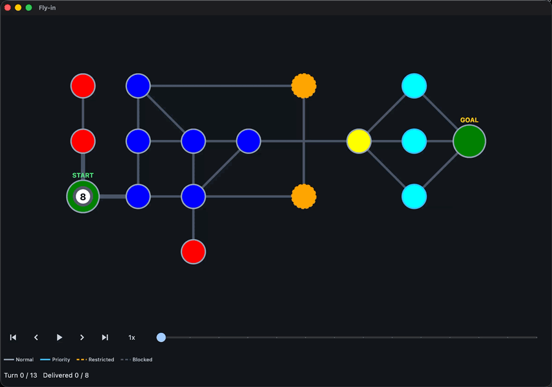

*This project has been created as part of the 42 curriculum by tsito.*

<h1 align="center">Fly-in</h1>

  <strong>Conflict-free route planning for a fleet of autonomous drones</strong>
   
  Move every drone through a capacity-constrained network in as few turns as possible.

  
  
  
  
  

  <a href="#description">Description</a> •
  <a href="#instructions">Instructions</a> •
  <a href="#example">Example</a> •
  <a href="#algorithm-space-time-a">Algorithm</a> •
  <a href="#visualizer">Visualizer</a> •
  <a href="#performance">Performance</a> •
  <a href="#japanese">Japanese</a>

  

## Description

Fly-in is a 42 curriculum project to build a drone route-planning simulation.
It reads a network of zones and bidirectional connections, then schedules a
fleet of drones from a unique start hub to a unique end hub. The objective is
to deliver every drone in as few simulation turns as possible.

Drones can move simultaneously, but each turn must respect zone capacities,
connection capacities, blocked zones, and the additional movement cost of
restricted zones. The planner combines a space-time route search with
cooperative reservations, allowing later drones to choose another path or
wait when a resource is already reserved.

As required by the subject, the project is fully object-oriented and type-safe.
Its graph logic is implemented without libraries such as `networkx` or
`graphlib`, and the code passes both `flake8` and `mypy --strict`.

## Instructions

Requirements: Python 3.10+ and [uv](https://docs.astral.sh/uv/).

~~~sh
make install                                     # install dependencies
make run                                         # run the default easy map
make run MAP=maps/hard/01_maze_nightmare.txt     # run any map
make gui                                         # run the default map with the GUI
make gui MAP=maps/hard/01_maze_nightmare.txt     # run any map with the GUI
~~~

`make run` is a shortcut for:

~~~sh
uv run fly-in maps/hard/01_maze_nightmare.txt
~~~

Add `-g` / `--gui` to open the visualizer window alongside the terminal
output:

~~~sh
uv run fly-in maps/hard/01_maze_nightmare.txt --gui
~~~

Development commands:

~~~sh
make test         # run the pytest suite
make lint         # flake8 and mypy
make lint-strict  # flake8 and mypy --strict
make gui          # run with the visualizer
make debug        # run under Python's debugger
make clean        # remove Python caches
~~~

## Map format

A map begins with the number of drones. Every zone must be defined before any
connection that references it. Optional metadata is enclosed in square
brackets. Lines starting with `#` are comments, and zone names cannot contain
spaces or hyphens.

~~~text
# maps/easy/01_linear_path.txt
nb_drones: 2

start_hub: start 0 0 [color=green]
hub: waypoint1 1 0 [color=blue]
hub: waypoint2 2 0 [color=blue]
end_hub: goal 3 0 [color=red]

connection: start-waypoint1
connection: waypoint1-waypoint2
connection: waypoint2-goal
~~~

| Target | Metadata | Default |
| --- | --- | --- |
| Zone | `zone=normal｜priority｜restricted｜blocked` | `normal` |
| Zone | `color=<single-word color>` | none |
| Hub | `max_drones=<positive integer>` | `1` |
| Connection | `max_link_capacity=<positive integer>` | `1` |

| Zone type | Entry cost | Behavior |
| --- | ---: | --- |
| `normal` | 1 turn | Ordinary zone |
| `priority` | 1 turn | Preferred when two candidates tie |
| `restricted` | 2 turns | One turn in transit, then arrival |
| `blocked` | — | Never entered |

## Example

Running the two-drone map above:

~~~sh
uv run fly-in maps/easy/01_linear_path.txt
~~~

Each line of output represents one simulation turn and lists only the drones
that moved. Drones that are waiting or have already arrived are omitted. A
drone traveling toward a `restricted` zone is shown with both endpoints of
the connection:

~~~text
D1-waypoint1
D1-waypoint2 D2-waypoint1
D1-goal D2-waypoint2
D2-goal
~~~

Both drones reach the goal in 4 turns.

## Algorithm: Space-Time A*

Plain A* answers the question, "Which zone comes next?" That is not enough
here: a zone that is full on turn 3 may be free on turn 4, so the same zone can
be either a dead end or the best move depending on the timing.

`Space-Time A*` solves this by putting the clock inside the search state.
A node is not a zone but a zone *at a given turn*:

~~~python
@dataclass(frozen=True)
class _SearchState:
    turn: int
    zone_name: str
~~~

The scheduling strategy is based on ideas from Cooperative Pathfinding:
drones are planned sequentially, and each completed route reserves the zones
and connections it uses over time. Later drones treat those reservations as
constraints during their own search.

From there, the search proceeds with three key elements:

**1. Cost function**

Candidates are ranked by the usual `f = g + h`, where `g` is the turn already
reached and `h` is the estimated turns still to go:

~~~text
f(state) = state.turn + min_turns_to_goal[state.zone_name]
~~~

`min_turns_to_goal` comes from a single backward weighted search from the
goal, done once before any drone is planned and reused by all of them. It
provides the estimate used to order candidates. Ties are broken in favor of
`priority` zones.

**2. Neighbors**

Each state expands into moves to adjacent zones and the option to wait in
place for one turn. Waiting is a meaningful choice: letting a busy corridor
clear is often faster than taking a detour. A move is discarded if the
destination is `blocked`, or if the zone or connection is already at capacity
during any of the required turns.

**3. Cooperative reservations**

Routes are planned one drone at a time. Once a route is found, its occupied
time slots are recorded in `RouteSchedule`:

~~~python
ZoneSlot       = tuple[int, str]        # (turn, zone)          -> drones inside
ConnectionSlot = tuple[int, str, str]   # (turn, zone_a, zone_b) -> drones crossing
~~~

Connection endpoints are sorted before they are used as a key, so travel in
either direction consumes the same shared capacity. The next drone treats
those reservations as constraints and either routes around them or waits.

This strategy finds an early valid route for each drone while accounting for
the routes already scheduled. Because drones are planned sequentially, it
does not claim to find the globally optimal fleet schedule for every graph.

Entering a `restricted` zone takes two turns, spent on the connection itself:

~~~text
turn 0: start
turn 1: Transit(start, restricted)   # in flight, holding the connection
turn 2: restricted
~~~

~~~mermaid
flowchart TD
    A["Load and validate the map"] --> B["Precompute goal-distance estimates"]
    B --> C["Select the next drone"]
    C --> D["Search for a route using current reservations"]
    D --> E{"Route found?"}
    E -- No --> F["Report that no valid route exists"]
    E -- Yes --> G["Reserve the route's zones and connections"]
    G --> H{"All drones planned?"}
    H -- No --> C
    H -- Yes --> I["Render the completed schedule"]
~~~

## Visualizer

The terminal output stays plain text, because the subject fixes its format
exactly. The visual feedback therefore lives in the GUI: `--gui` opens a Flet
window replaying the same schedule.

The turn-by-turn text shows *what* happened; the window helps explain *why*.
Watching the drones move reveals where the fleet splits across parallel
paths, which corridor creates a bottleneck, and why a drone waits instead of
taking a detour. Zones retain the coordinates from the map file and are scaled
to fit the canvas without changing the aspect ratio, preserving the shape
drawn by the map author. The window is freely resizable, and the map adjusts
to fit it.

Each element of the map format has its own visual representation, making it
possible to verify the planner's constraints directly in the visualization:

| Channel | Meaning |
| --- | --- |
| Fill color | Supported `color=` value; unsupported or absent values use the zone type |
| Rainbow gradient | `color=rainbow`, swept around the zone center |
| Outline color | Zone type |
| Dashed outline | `restricted` or `blocked` |
| Circle size | Start and end hubs are drawn larger |
| `START` / `GOAL` badge | Start and end hubs |
| Line width | `max_link_capacity` of a connection |
| White dot | One drone, animated between turns |
| Numbered dot | Seven or more drones stacked on one spot |

Zone names are not drawn directly on the map, preventing labels from
overlapping. The same information is available on hover: a zone shows its
name, role, type, capacity, position, and color; a connection shows its two
endpoints and capacity; and a drone shows its identifier.

Two to six drones sharing a spot sit on the corners of a regular polygon
around its center. From seven, they stack behind a single dot carrying the
count, so a crowded start hub never spills over its neighbours. A drone in
transit sits at the midpoint of its connection.

| Control | Action |
| --- | --- |
| `→` / `←` | One turn forward or back |
| `Space` | Play or pause |
| `Home` | Back to the first turn |
| Speed button | Cycle 1x, 2x, 4x, 0.5x |
| Slider | Jump to any turn |

Playback controls, the slider, and the single-step keys make even a 43-turn
schedule easy to inspect. Pause at a suspicious turn, step back once, and
check the tooltips for the zones involved.

### Why Flet rather than tkinter

**Animation**

A marker declares `ft.Animation` once and then only needs to be given a new
position; the framework interpolates the frames. Achieving the same effect in
tkinter would require a custom `after()` loop that redraws every drone on each
frame.

**Ready-made widgets**

The toolkit provides the slider, speed button, and a layout that automatically
adapts when the window is resized, avoiding the need to build and reposition
these elements manually.

tkinter has the advantage of requiring no additional dependency, but this
project already handles dependency installation through `make install`.

## Performance

The subject evaluates route quality by the number of simulation turns rather
than CPU time. Every provided map meets its target, and the optional challenger
map beats the reference result by two turns.

| Map | Drones | Turns | Target | Margin |
| --- | ---: | ---: | ---: | ---: |
| Easy — Linear path | 2 | 4 | ≤ 6 | 2 |
| Easy — Simple fork | 4 | 4 | ≤ 8 | 4 |
| Easy — Basic capacity | 4 | 4 | ≤ 6 | 2 |
| Medium — Dead end trap | 5 | 8 | ≤ 12 | 4 |
| Medium — Circular loop | 6 | 15 | ≤ 15 | 0 |
| Medium — Priority puzzle | 5 | 7 | ≤ 12 | 5 |
| Hard — Maze nightmare | 8 | 13 | ≤ 30 | 17 |
| Hard — Capacity hell | 12 | 16 | ≤ 35 | 19 |
| Hard — Ultimate challenge | 15 | 26 | ≤ 45 | 19 |
| Challenger — The Impossible Dream | 25 | **43** | Reference: 45 | **2** |

## Project structure

~~~text
src/fly_in/
├── main.py           # CLI entry point
├── parsing/          # map file -> Map
├── models/           # Map, Zone, Connection
├── routing/
│   ├── route_planner.py    # Space-Time A*
│   └── route_schedule.py   # routes and capacity reservations
└── rendering/
    ├── terminal.py   # the required per-turn output
    └── gui/          # Flet visualizer (board/ draws the map)
~~~

The 286 tests cover map parsing and error handling, routing through `blocked`,
`restricted`, and `priority` zones, capacity reservations, strategic waiting,
terminal output, and the visualizer's per-turn state, layout, and controls.
All source files pass `flake8` and `mypy --strict`.

## Resources

- [argparse](https://docs.python.org/3/library/argparse.html),
  [heapq](https://docs.python.org/3/library/heapq.html),
  [dataclasses](https://docs.python.org/3/library/dataclasses.html)
- [Pydantic](https://pydantic.dev/docs/validation/latest/get-started/)
- [A* — Wikipedia](https://en.wikipedia.org/wiki/A*_search_algorithm)
- [Cooperative Pathfinding — David Silver](https://cw.fel.cvut.cz/b211/_media/courses/b3m33mkr/coop-path-aiwisdom.pdf)
  — referenced for sequential agent planning and space-time reservations
- [Flet](https://flet.dev/docs)

### AI usage

AI was used in the following areas of the project:

| Part | How AI was used |
| --- | --- |
| Reading the subject | Clarifying the requirements and the scoring rules |
| `routing/` | Discussing the space-time search and the reservation strategy, then reviewing the implementation |
| `parsing/`, `models/` | Proposing malformed inputs and edge cases the parser must reject |
| `rendering/gui/` | Reviewing and refactoring the Flet visualizer for readability |
| `tests/` | Generating test cases from the edge cases discussed above |
| `Makefile`, docstrings, `README.md` | Generating the content |

All generated content was checked against the subject using the test suite,
`flake8`, `mypy --strict`, and the provided maps. These uses are disclosed to
keep the review process transparent. The author remains responsible for
understanding, explaining, and maintaining all submitted code.

---

## Japanese

<strong>open</strong>

## Description

Fly-inは、ドローン経路探索シミュレーションを作成する42cursusの課題である。
zoneと双方向のconnectionからなるネットワークを読み込み、複数のドローンを一意な
start hubから一意なend hubまで移動させる。目的は、すべてのドローンを可能な限り
少ないシミュレーションターンで到着させることである。

ドローンは同時に移動できるが、各ターンでzoneとconnectionの収容数、`blocked`の
zone、`restricted`のzoneの追加移動コストを守る必要がある。プランナーは空間と
時間を含む経路探索と協調的な予約を組み合わせ、予約済みの場所を後続のドローンが
迂回するか、空くまで待機できるようにする。

課題の要件に従い、プロジェクト全体をオブジェクト指向かつ型安全に実装している。
グラフ処理には`networkx`や`graphlib`などのライブラリを使用せず、コードは
`flake8`と`mypy --strict`の両方を通過する。

## Instructions

必要なものはPython 3.10以降と[uv](https://docs.astral.sh/uv/)。

~~~sh
make install                                     # 依存パッケージを入れる
make run                                         # 既定のeasyマップを実行する
make run MAP=maps/hard/01_maze_nightmare.txt     # マップを指定して実行する
make gui                                         # 既定のマップをGUI付きで実行する
make gui MAP=maps/hard/01_maze_nightmare.txt     # 指定したマップをGUI付きで実行する
~~~

`make run`は次のコマンドの短縮形である。

~~~sh
uv run fly-in maps/hard/01_maze_nightmare.txt
~~~

`-g` / `--gui`を付けると、ターミナル出力に加えて可視化ウィンドウが開く。

~~~sh
uv run fly-in maps/hard/01_maze_nightmare.txt --gui
~~~

開発用のコマンド:

~~~sh
make test         # pytestを実行する
make lint         # flake8とmypyを実行する
make lint-strict  # flake8とmypy --strictを実行する
make gui          # 可視化付きで実行する
make debug        # デバッガ付きで実行する
make clean        # Pythonのキャッシュを削除する
~~~

## Map format

マップの先頭にはドローン数を記述する。各zoneは、そのzoneを参照するconnectionより
前に定義する必要がある。メタデータは省略可能で、角括弧の中に記述する。`#`から
始まる行はコメントとして扱われる。zone名に空白やハイフンは使用できない。

~~~text
# maps/easy/01_linear_path.txt
nb_drones: 2

start_hub: start 0 0 [color=green]
hub: waypoint1 1 0 [color=blue]
hub: waypoint2 2 0 [color=blue]
end_hub: goal 3 0 [color=red]

connection: start-waypoint1
connection: waypoint1-waypoint2
connection: waypoint2-goal
~~~

| 対象 | メタデータ | 既定値 |
| --- | --- | --- |
| zone | `zone=normal｜priority｜restricted｜blocked` | `normal` |
| zone | `color=<1語の色名>` | なし |
| ハブ | `max_drones=<正の整数>` | `1` |
| connection | `max_link_capacity=<正の整数>` | `1` |

| zoneの種類 | 進入コスト | 動作 |
| --- | ---: | --- |
| `normal` | 1ターン | 通常のzone |
| `priority` | 1ターン | 候補が同点のときに優先される |
| `restricted` | 2ターン | 1ターン移動してから到着する |
| `blocked` | — | 進入できない |

## Example

上のマップを実行する。

~~~sh
uv run fly-in maps/easy/01_linear_path.txt
~~~

出力の1行がシミュレーションの1ターンに対応し、そのターンに移動した機体だけが
表示される。待機中の機体と到着済みの機体は省略される。`restricted`のzoneへ
移動中の機体は、connectionの両端をハイフンでつないで表す。

~~~text
D1-waypoint1
D1-waypoint2 D2-waypoint1
D1-goal D2-waypoint2
D2-goal
~~~

2機とも4ターンでgoalに着く。

## Algorithm: Space-Time A*

通常のA*が決めるのは「次にどのzoneへ進むか」だけだが、この問題ではそれだけ
では不十分である。3ターン目には満員だったzoneが、4ターン目には空いている
こともある。同じzoneでも、通過するタイミングによって行き止まりにも最善の
選択肢にもなり得る。

`Space-Time A*`では、探索状態に時刻を含めることでこの問題を解決する。ノードは
単なるzoneではなく、「何ターン目のどのzoneか」を表す。

~~~python
@dataclass(frozen=True)
class _SearchState:
    turn: int
    zone_name: str
~~~

スケジューリング戦略は、[Cooperative Pathfinding](https://cw.fel.cvut.cz/b211/_media/courses/b3m33mkr/coop-path-aiwisdom.pdf)
の考え方を参考にしている。ドローンを順番に計画し、確定した経路が使用するzoneと
connectionを時間ごとに予約する。後続のドローンは、それらの予約を制約として
自身の経路を探索する。

探索の要点は3つある。

**1. コスト関数**

候補の順位は`f = g + h`で決める。`g`はそこへ着くまでにかかったターン数、
`h`はgoalまでに残ると見込まれるターン数である。

~~~text
f(state) = state.turn + min_turns_to_goal[state.zone_name]
~~~

`min_turns_to_goal`は、goalから逆向きの重み付き探索を1回行って作る表である。
どの機の計画よりも先に一度だけ計算し、以降は全機で使い回す。探索候補はこの値を
見積もりとして並べ、同点であれば`priority`のzoneを選ぶ。

**2. 候補の展開**

ひとつの状態から、隣接する各zoneへの移動と、その場で1ターン待機する選択肢を
生成する。混雑した通路が空くのを待つほうが、迂回するより速い場合もあるため、
待機も有効な選択肢となる。行き先が`blocked`の場合や、必要なターンにzoneまたは
connectionがすでに収容上限に達している場合、その移動は候補から除外する。

**3. 協調的な予約**

ドローンの経路は1機ずつ順番に計画する。経路が決まると、その機体が占有する
時刻と場所を`RouteSchedule`に記録する。

~~~python
ZoneSlot       = tuple[int, str]        # (ターン, zone)             -> 中にいる機数
ConnectionSlot = tuple[int, str, str]   # (ターン, zone_a, zone_b)   -> 通過する機数
~~~

connectionは両端の名前を並べ替えてからキーとして使うため、どちらの方向に通過しても
同じ収容数を消費する。次の機体はこの予約を制約として扱い、迂回するか、空くまで
待機する。

この方式では、すでに確定した経路を考慮しながら、各ドローンについて早く到着
できる有効な経路を探索する。ドローンを順番に計画する方式であるため、あらゆる
グラフにおいてドローン全体の大域的な最適解が得られるとは限らない。

`restricted`のzoneに入るには2ターンかかり、そのうち1ターンはconnectionの上で
過ごす。

~~~text
ターン0: start
ターン1: Transit(start, restricted)   # 移動中。connectionを占有している
ターン2: restricted
~~~

~~~mermaid
flowchart TD
    A["マップを読み込んで 検証する"] --> B["各zoneからgoalまでの距離を 事前計算する"]
    B --> C["次のドローンを選ぶ"]
    C --> D["現在の予約を考慮して 経路を探索する"]
    D --> E{"経路が見つかった?"}
    E -- いいえ --> F["有効な経路がないことを 通知する"]
    E -- はい --> G["経路が使うzoneと connectionを予約する"]
    G --> H{"全機の計画が完了した?"}
    H -- いいえ --> C
    H -- はい --> I["完成したスケジュールを 出力する"]
~~~

## Visualizer

ターミナル出力の形式は課題で厳密に定められているため、装飾のないテキストとして
表示する。視覚的な情報はGUIが担い、`--gui`を付けるとFletのウィンドウが開いて
同じ計画を再生する。

ターンごとのテキストから分かるのは「何が起きたか」だが、GUIでは「なぜそう
なったか」も把握しやすい。機体がどこで複数の経路に分かれ、どの通路がボトル
ネックになり、なぜ迂回せず待機したのかを動きから確認できる。zoneにはマップ
ファイルの座標を使用し、縦横比を保ったまま画面内に収めるため、作者が意図した
マップの形状が維持される。ウィンドウは自由に拡大・縮小でき、マップもその大きさに
合わせて調整される。

マップ形式の各要素にはそれぞれ視覚表現を割り当てているため、計画が制約を守って
いるかを画面上で確認できる。

| 表現 | 意味 |
| --- | --- |
| 塗りの色 | 対応済みの`color=`。未対応または未指定ならzoneの種類の色 |
| 虹色のグラデーション | `color=rainbow`。色が円周を一周する |
| 輪郭の色 | zoneの種類 |
| 破線の輪郭 | `restricted`または`blocked` |
| 円の大きさ | startとgoalは大きく描く |
| `START` / `GOAL`の文字 | startとgoal |
| 線の太さ | connectionの`max_link_capacity` |
| 白い点 | ドローン1機。ターン間を移動する |
| 数字入りの点 | 同じ場所に7機以上が重なっている |

zone名は、ラベル同士の重なりを避けるためマップ上には表示しない。代わりに、
マウスカーソルを重ねると詳細が表示される。zoneでは名前、役割、種類、収容数、
座標、色を、connectionでは両端のzoneと収容数を、ドローンでは識別番号を確認できる。

同じ場所に2〜6機が存在する場合は、中心の周囲に正多角形の頂点を描くように配置
する。7機以上の場合は1つの点にまとめ、機数を数字で表示する。これにより、混雑した
startの表示が隣のzoneまではみ出すことを防ぐ。移動中の機体はconnectionの中点に置く。

| 操作 | 動作 |
| --- | --- |
| `→` / `←` | 1ターン進む／戻る |
| `Space` | 再生と一時停止 |
| `Home` | 最初のターンに戻る |
| 速度ボタン | 1x、2x、4x、0.5xを順に切り替える |
| スライダー | 任意のターンへ移動する |

再生と一時停止、スライダー、1ターン単位の移動を使うことで、43ターンの計画でも
容易に確認できる。気になるターンで一時停止し、1ターン戻って、関係するzoneの
ツールチップを確認できる。

### Why Flet rather than tkinter

**アニメーション**

マーカーに`ft.Animation`を一度設定すれば、あとは新しい座標を渡すだけで、途中の
フレームはフレームワークが補間する。tkinterで同じ動きを実現するには、`after()`を
使ったループを実装し、フレームごとに全機を描画し直す必要がある。

**標準のUIコンポーネント**

スライダー、速度ボタン、ウィンドウの伸縮に追従するレイアウトが標準で用意されて
いる。tkinterでは、これらを自分で構築し、配置を再計算する必要がある。

tkinterには追加の依存パッケージが不要という利点がある。一方、このプロジェクト
では`make install`によって依存パッケージをまとめて導入できる。

## Performance

課題では、経路の品質を計算時間ではなくシミュレーションのターン数で評価する。
提供されたマップはすべて目標ターン数以内で完了し、任意課題のchallengerでも
参考記録を2ターン上回る結果を達成している。

| マップ | 機数 | 結果 | 目標 | 差 |
| --- | ---: | ---: | ---: | ---: |
| Easy — Linear path | 2 | 4 | 6以下 | 2 |
| Easy — Simple fork | 4 | 4 | 8以下 | 4 |
| Easy — Basic capacity | 4 | 4 | 6以下 | 2 |
| Medium — Dead end trap | 5 | 8 | 12以下 | 4 |
| Medium — Circular loop | 6 | 15 | 15以下 | 0 |
| Medium — Priority puzzle | 5 | 7 | 12以下 | 5 |
| Hard — Maze nightmare | 8 | 13 | 30以下 | 17 |
| Hard — Capacity hell | 12 | 16 | 35以下 | 19 |
| Hard — Ultimate challenge | 15 | 26 | 45以下 | 19 |
| Challenger — The Impossible Dream | 25 | **43** | 参考記録45 | **2** |

## Project structure

~~~text
src/fly_in/
├── main.py           # CLIの入り口
├── parsing/          # マップファイル -> Map
├── models/           # Map、Zone、Connection
├── routing/
│   ├── route_planner.py    # Space-Time A*
│   └── route_schedule.py   # 経路と収容数の予約
└── rendering/
    ├── terminal.py   # 課題が求めるターンごとの出力
    └── gui/          # Fletの可視化（board/がマップを描く）
~~~

286件のテストで、マップの解析と不正な入力、blocked・restricted・priorityを含む
経路探索、収容数の予約、必要に応じた待機、ターミナル出力、可視化におけるターン
ごとの状態・配置・操作を確認している。すべてのソースが`flake8`と
`mypy --strict`を通過する。

## Resources

- [argparse](https://docs.python.org/ja/3/library/argparse.html)、
  [heapq](https://docs.python.org/ja/3/library/heapq.html)、
  [dataclasses](https://docs.python.org/ja/3/library/dataclasses.html)
- [Pydantic](https://pydantic.dev/docs/validation/latest/get-started/)
- [A* - Wikipedia](https://ja.wikipedia.org/wiki/A*)
- [Cooperative Pathfinding — David Silver](https://cw.fel.cvut.cz/b211/_media/courses/b3m33mkr/coop-path-aiwisdom.pdf)
  — エージェントを順番に計画し、空間と時間を予約する方式の参考資料
- [Flet](https://flet.dev/docs)

### AI usage

AIは次の部分で利用した。

| 部分 | 利用のしかた |
| --- | --- |
| 課題文の読解 | 要件と採点基準の確認 |
| `routing/` | 空間と時間を合わせた探索と予約方式の検討、および実装のレビュー |
| `parsing/`、`models/` | パーサーが弾くべき不正な入力と境界条件の洗い出し |
| `rendering/gui/` | Fletの可視化のレビューと、読みやすさのためのリファクタリング |
| `tests/` | 上で洗い出した境界条件をもとにしたテストの生成 |
| `Makefile`、docstring、`README.md` | 内容の生成 |

生成した内容はすべて、課題文、テスト、`flake8`、`mypy --strict`、提供された
マップに照らして確認している。レビューの透明性を保つために利用箇所を明示して
いるが、提出したコードを理解し、説明し、保守する責任は作者にある。

