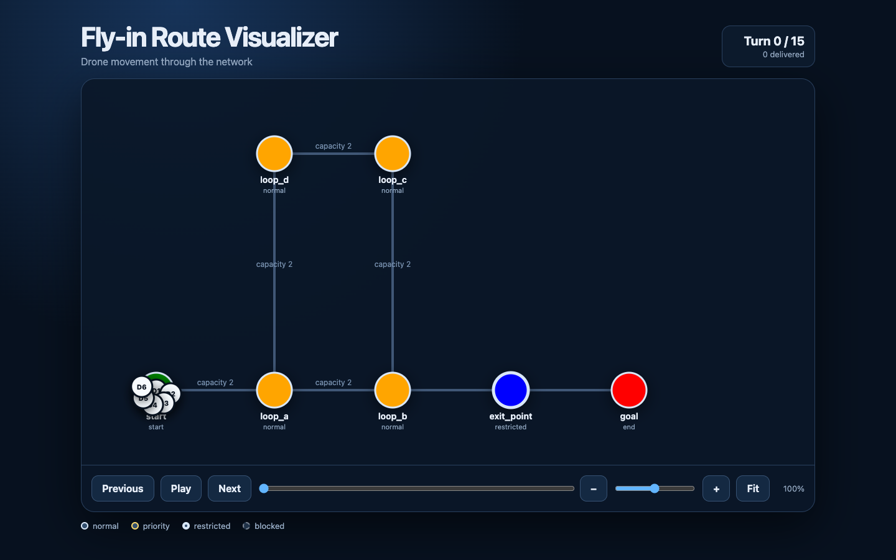
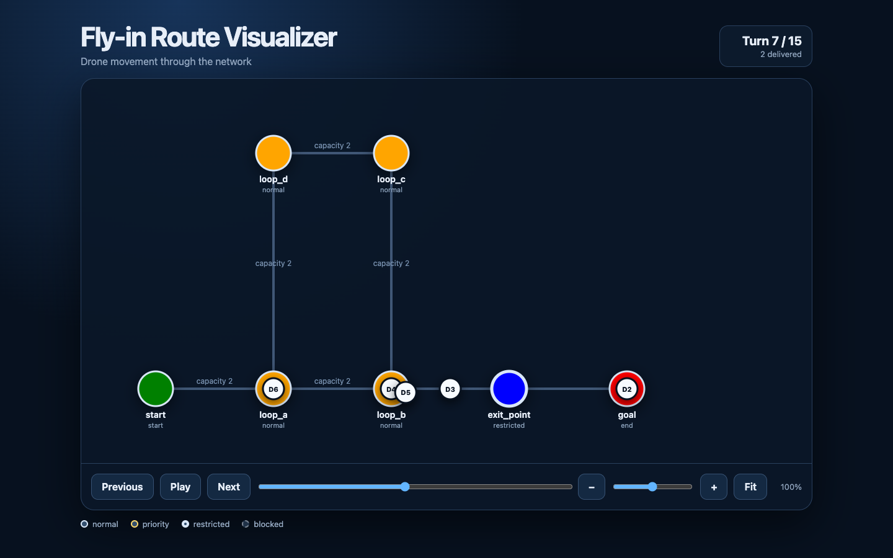

*This project has been created as part of the 42 curriculum by tsito.*

<h1 align="center">Fly-in</h1>

  <strong>Space-time route planning for a fleet of autonomous drones</strong>
   
  Move every drone through a constrained network in as few turns as possible.

  
  
  
  
  

  <a href="#quick-start">Quick Start</a> •
  <a href="#algorithm-and-implementation">Algorithm</a> •
  <a href="#visual-representation">Visualizer</a> •
  <a href="#performance">Performance</a> •
  <a href="#日本語版">日本語版</a>

## Overview

Fly-in is a multi-drone routing simulator. It parses a graph of zones and
bidirectional connections, then schedules every drone from the start zone to
the goal while respecting movement costs and capacity constraints.

The planner must solve two problems at the same time:

1. Find a short route through the graph.
2. Decide **when** each drone may use every zone and connection.

That temporal component turns an ordinary graph search into a space-time
search. A location is not only a zone; it is a zone occupied at a particular
simulation turn.

| Zone type | Entry cost | Behavior |
| --- | ---: | --- |
| Normal | 1 turn | Standard traversable zone |
| Priority | 1 turn | Preferred when candidate costs are equal |
| Restricted | 2 turns | Drone spends one turn in transit before arrival |
| Blocked | — | Never entered by the planner |

### Highlights

- Space-Time A*-style search over <code>(zone, turn)</code> states
- Precomputed goal-distance estimates reused by every drone
- Strategic waiting when movement is temporarily unavailable
- Zone and connection capacity reservations
- Explicit in-flight <code>Transit</code> states for restricted movement
- ANSI-colored terminal timeline
- Standalone interactive HTML/SVG visualizer
- 43-turn solution for the 45-turn challenger reference
- Fully typed Python with <code>mypy --strict</code>

## Table of contents

- [Quick Start](#quick-start)
- [Map Format](#map-format)
- [Example](#example)
- [Algorithm and Implementation](#algorithm-and-implementation)
- [Visual Representation](#visual-representation)
- [Architecture](#architecture)
- [Performance](#performance)
- [Testing and Quality](#testing-and-quality)
- [Project Structure](#project-structure)
- [Resources and AI Usage](#resources-and-ai-usage)
- [日本語版](#日本語版)

## Quick Start

### Requirements

- Python 3.10 or later
- [uv](https://docs.astral.sh/uv/)

Install all project and development dependencies:

~~~sh
make install
~~~

Run the default easy map:

~~~sh
make run
~~~

Run a specific map:

~~~sh
make run MAP=maps/medium/03_priority_puzzle.txt
~~~

The equivalent direct command is:

~~~sh
uv run fly-in maps/medium/03_priority_puzzle.txt
~~~

### Generate the graphical visualizer

~~~sh
uv run fly-in maps/medium/02_circular_loop.txt \
  --html simulation.html

open simulation.html
~~~

The generated file is self-contained. It embeds the HTML, CSS, JavaScript, map,
and complete simulation, so it can be opened without a server or internet
connection.

### Development commands

~~~sh
make debug        # Run with Python's debugger
make test         # Run the pytest suite
make lint         # Run flake8 and mypy
make lint-strict  # Run flake8 and mypy --strict
make clean        # Remove Python caches
~~~

## Map Format

A map starts with a positive drone count. Zones must be defined before the
connections that reference them. Metadata is optional and appears inside
square brackets.

~~~text
nb_drones: <positive_integer>

start_hub: <name> <x> <y> [metadata]
end_hub: <name> <x> <y> [metadata]
hub: <name> <x> <y> [metadata]

connection: <zone1>-<zone2> [metadata]
~~~

Supported metadata:

| Target | Metadata | Default |
| --- | --- | --- |
| Zone | <code>zone=normal｜priority｜restricted｜blocked</code> | <code>normal</code> |
| Zone | <code>color=&lt;single-word color&gt;</code> | none |
| Hub | <code>max_drones=&lt;positive integer&gt;</code> | <code>1</code> |
| Connection | <code>max_link_capacity=&lt;positive integer&gt;</code> | <code>1</code> |

Comments begin with <code>#</code>. Zone names cannot contain spaces or dashes.

## Example

### Input

~~~text
nb_drones: 2

start_hub: start 0 0 [color=green]
hub: waypoint1 1 0 [color=blue]
hub: waypoint2 2 0 [color=blue]
end_hub: goal 3 0 [color=red]

connection: start-waypoint1
connection: waypoint1-waypoint2
connection: waypoint2-goal
~~~

### Output

Each line is one simulation turn. Only drones that move during that turn are
printed.

~~~text
D1-waypoint1
D1-waypoint2 D2-waypoint1
D1-goal D2-waypoint2
D2-goal
~~~

## Algorithm and Implementation

### 1. Space-time search

The search state combines a physical zone with a simulation turn:

~~~python
@dataclass(frozen=True)
class _SearchState:
    turn: int
    zone_name: str
~~~

This distinction allows the same zone to appear multiple times in the search
at different turns. From each state, the planner generates:

- movement to every valid adjacent zone;
- a one-turn wait in the current zone.

Candidates are ranked by:

~~~text
elapsed turns + estimated turns to the goal
~~~

When two candidates have the same estimate, a priority zone is preferred.
Blocked zones are never generated.

### 2. Reusable goal-distance estimate

Before planning any drone, the planner runs a backward weighted search from the
goal and stores one turn estimate per reachable zone. This table is calculated
once and reused by every drone instead of recomputing a graph distance during
each search.

### 3. Cooperative reservations

Drones are planned one at a time. After finding a route, the planner registers
its occupied resources in <code>RouteSchedule</code>:

~~~python
ZoneSlot = tuple[int, str]
ConnectionSlot = tuple[int, str, str]
~~~

These keys mean:

- <code>(turn, zone_name)</code>: how many drones occupy a zone on one turn;
- <code>(turn, zone_a, zone_b)</code>: how many drones traverse a connection.

Connection endpoints are sorted before creating the key, so both travel
directions consume the same connection capacity.

Later drones treat full reservation slots as unavailable and may choose another
path or wait.

### 4. Restricted movement

Entering a restricted zone costs two turns:

~~~text
Turn 0: start
Turn 1: Transit(start, restricted)
Turn 2: restricted
~~~

The <code>Transit</code> value reserves the connection during flight and lets
both renderers show that the drone has left its origin but has not yet arrived.

### Planning flow

~~~mermaid
flowchart TD
    A[Load and validate map] --> B[Precompute goal-distance estimates]
    B --> C{Unplanned drone remains?}
    C -- Yes --> D[Start search at start zone and turn 0]
    D --> E[Choose lowest-priority candidate]
    E --> F{Goal reached?}
    F -- No --> G[Generate adjacent moves and waiting]
    G --> H{Zone and connection capacity available?}
    H -- No --> E
    H -- Yes --> I[Add unseen space-time state]
    I --> E
    F -- Yes --> J[Reconstruct route and Transit states]
    J --> K[Reserve zones and connections]
    K --> C
    C -- No --> L[Render terminal and optional HTML output]
~~~

### Design trade-off

The planner optimizes each drone against routes already reserved by earlier
drones. This keeps conflict handling straightforward and performs well on the
provided maps, but it is not a global joint search over every possible fleet
schedule.

The candidate list intentionally favors readable code. Selecting the next
candidate scans the current list, and neighbor discovery scans the map's
connections. Project scoring is based on simulation turns rather than planner
wall-clock time.

## Visual Representation

### Colored terminal timeline

The terminal renderer preserves the required movement format and colors zone
names when the map specifies a supported ANSI color:

~~~text
D1-fast_junction D3-start-slow_path1
D1-fast_path D2-fast_junction D3-slow_path1
D1-merge_point D2-fast_path D3-slow_path2
~~~

During restricted movement, the origin and destination names use their own
zone colors. Waiting and delivered drones are omitted from the line.

### Interactive HTML/SVG visualizer

<table>
  <tr>
    <td width="50%">
      
       
      <em>Fit view: the complete circular loop map</em>
    </td>
    <td width="50%">
      
       
      <em>Turn 7: simultaneous drone positions and transit</em>
    </td>
  </tr>
</table>

The optional visualizer:

- draws zones and connections from map coordinates using SVG;
- uses map colors and distinct outlines for zone types;
- places active drones on zones;
- places in-flight drones halfway along restricted connections;
- supports Previous, Next, Play, Pause, and a turn slider;
- displays delivered-drone and turn counters;
- initially fits the complete map to the available width;
- zooms the complete SVG without changing its internal layout;
- enables scrolling after zooming into a large map.

Python performs all route planning. JavaScript only displays the simulation
data embedded by <code>render_html()</code>.

## Architecture

~~~mermaid
flowchart LR
    CLI[CLI / main.py]

    subgraph Parsing
        Parser[MapParser]
        Builder[MapBuilder]
    end

    subgraph Models
        MapModel[Map]
        Zone[Zone]
        Connection[Connection]
    end

    subgraph Routing
        Planner[RoutePlanner]
        Schedule[RouteSchedule]
        Transit[Transit]
    end

    subgraph Rendering
        Terminal[terminal.py]
        HTML[html.py]
    end

    CLI --> Parser
    Parser --> Builder
    Builder --> MapModel
    MapModel --> Zone
    MapModel --> Connection
    MapModel --> Planner
    Planner --> Schedule
    Planner --> Transit
    Schedule --> Terminal
    Schedule --> HTML
    MapModel --> Terminal
    MapModel --> HTML
    Terminal --> Output[Required terminal timeline]
    HTML --> File[Standalone simulation.html]
~~~

The parser, domain models, routing, reservations, and presentation remain
separate. Adding the HTML view did not change route-planning behavior.

## Performance

The subject scores route quality by total simulation turns, not by CPU time.
The current implementation meets every provided target and beats the optional
challenger reference.

| Map | Result | Subject target | Margin |
| --- | ---: | ---: | ---: |
| Easy — Linear path | 4 | ≤ 6 | 2 |
| Easy — Simple fork | 4 | ≤ 8 | 4 |
| Easy — Basic capacity | 4 | ≤ 6 | 2 |
| Medium — Dead end trap | 8 | ≤ 12 | 4 |
| Medium — Circular loop | 15 | ≤ 15 | 0 |
| Medium — Priority puzzle | 7 | ≤ 12 | 5 |
| Hard — Maze nightmare | 13 | ≤ 30 | 17 |
| Hard — Capacity hell | 16 | ≤ 35 | 19 |
| Hard — Ultimate challenge | 26 | ≤ 45 | 19 |
| Challenger — The Impossible Dream | **43** | Reference: 45 | **2** |

## Testing and Quality

~~~sh
make test
make lint
make lint-strict
~~~

The test suite currently contains 49 tests covering:

- valid maps, comments, metadata, and defaults;
- malformed lines, duplicate definitions, and invalid references;
- blocked, restricted, and priority routing;
- zone and connection reservations;
- strategic waiting and unavailable paths;
- terminal colors and Transit output;
- standalone HTML generation and CLI integration.

All source files pass <code>flake8</code> and
<code>mypy --strict</code>.

## Project Structure

~~~text
.
├── assets/
│   ├── gui-overview.png
│   └── gui-turn-detail.png
├── src/fly_in/
│   ├── main.py
│   ├── models/
│   ├── parsing/
│   ├── rendering/
│   │   ├── html.py
│   │   └── terminal.py
│   └── routing/
│       ├── route_planner.py
│       └── route_schedule.py
├── tests/
├── Makefile
└── pyproject.toml
~~~

## Resources and AI Usage

### Resources

- [Python argparse documentation](https://docs.python.org/3/library/argparse.html)
- [Python heapq documentation](https://docs.python.org/3/library/heapq.html)
- [Python dataclasses documentation](https://docs.python.org/3/library/dataclasses.html)
- [Python typing documentation](https://docs.python.org/3/library/typing.html)
- [Pydantic documentation](https://docs.pydantic.dev/)
- [A* search algorithm](https://en.wikipedia.org/wiki/A*_search_algorithm)
- [Cooperative Pathfinding — David Silver](https://cw.fel.cvut.cz/b211/_media/courses/b3m33mkr/coop-path-aiwisdom.pdf)
- [SVG tutorial — MDN](https://developer.mozilla.org/en-US/docs/Web/SVG/Tutorial)

### AI usage

AI was used to clarify assignment requirements, discuss route-planning and
scheduling trade-offs, review implementation details, propose edge cases, and
generate tests, Makefile content, docstrings, and documentation.

AI generated the HTML, CSS, and JavaScript graphical visualizer together with
its Python serialization and CLI integration, based on behavior and design
requirements specified by the author. The author ran the application, inspected
its output, identified the layout failure on the challenger map, and iterated
on fit-to-width and zoom behavior with AI assistance.

The generated work was checked against the subject with automated tests,
<code>flake8</code>, <code>mypy --strict</code>, provided maps, and real-browser
testing. AI use is disclosed explicitly so the implementation can be reviewed
transparently; the author remains responsible for understanding, explaining,
and maintaining all submitted code.

---

## 日本語版

<strong>日本語訳を開く</strong>

## 概要

Fly-inは、複数のドローンをstartゾーンからgoalまで移動させる経路計画
シミュレーターである。ゾーンと接続の収容数、blockedゾーン、
restrictedゾーンへの2ターン移動を守りながら、全ドローンの到着ターン数を
小さくする。

通常のグラフ探索では「どこを通るか」を決めるが、この課題では「何ターン目に
通るか」も決める必要がある。そのため、探索状態はゾーン名とターンを組み
合わせて表現する。

| ゾーン | 移動コスト | 動作 |
| --- | ---: | --- |
| normal | 1ターン | 通常のゾーン |
| priority | 1ターン | 推定コストが同じ場合に優先 |
| restricted | 2ターン | 1ターン接続上を移動してから到着 |
| blocked | — | 進入不可 |

## 実行方法

依存パッケージをインストールする。

~~~sh
make install
~~~

マップを指定して実行する。

~~~sh
uv run fly-in maps/medium/03_priority_puzzle.txt
~~~

HTML GUIも生成する。

~~~sh
uv run fly-in maps/medium/02_circular_loop.txt \
  --html simulation.html

open simulation.html
~~~

生成されるHTMLにはCSS、JavaScript、マップ、シミュレーションデータが
すべて含まれるため、Webサーバーを使わず直接開ける。

## マップ形式

~~~text
nb_drones: <正の整数>

start_hub: <名前> <x> <y> [メタデータ]
end_hub: <名前> <x> <y> [メタデータ]
hub: <名前> <x> <y> [メタデータ]

connection: <ゾーン1>-<ゾーン2> [メタデータ]
~~~

ゾーンの種類は<code>normal</code>、<code>priority</code>、
<code>restricted</code>、<code>blocked</code>である。
<code>max_drones</code>はゾーンの収容数、
<code>max_link_capacity</code>は接続の収容数を表す。

## アルゴリズム

### Space-Time A*形式の探索

探索状態は次の2つを持つ。

~~~text
(zone_name, turn)
~~~

現在状態から、隣接ゾーンへの移動と現在地での1ターン待機を作る。候補は、
経過ターンとgoalまでの推定ターン数の合計で比較する。同じ場合は
priorityゾーンを優先する。

### 予約表

ドローンは1機ずつ経路を計画する。経路が決まると、そのドローンが使う
ゾーンと接続をターンごとに<code>RouteSchedule</code>へ予約する。後続
ドローンは満員の予約を避け、別経路を選ぶか待機する。

~~~text
(turn, zone_name)
(turn, zone_a, zone_b)
~~~

### restrictedへの移動

~~~text
Turn 0: start
Turn 1: Transit(start, restricted)
Turn 2: restricted
~~~

<code>Transit</code>により、接続上を移動しているターンも予約と表示の
対象になる。

## 表示機能

ターミナルでは、1行に1ターン分の移動を表示する。待機中と到着済みの
ドローンは省略し、restrictedへの移動中は接続名を表示する。

HTML GUIは次の機能を持つ。

- マップ座標を使ったSVG描画
- ゾーン色と種類の表示
- ゾーン上または接続上のドローン表示
- Previous、Next、Play、Pause、ターンスライダー
- ターン数と到着済みドローン数
- 大規模マップの初期全幅表示
- SVG全体の拡大縮小とスクロール

経路探索はPython側だけで行う。JavaScriptは
<code>render_html()</code>が埋め込んだ結果を表示するだけである。

## 性能

| マップ | 結果 | 課題目標 |
| --- | ---: | ---: |
| Easy — Linear path | 4 | 6以下 |
| Easy — Simple fork | 4 | 8以下 |
| Easy — Basic capacity | 4 | 6以下 |
| Medium — Dead end trap | 8 | 12以下 |
| Medium — Circular loop | 15 | 15以下 |
| Medium — Priority puzzle | 7 | 12以下 |
| Hard — Maze nightmare | 13 | 30以下 |
| Hard — Capacity hell | 16 | 35以下 |
| Hard — Ultimate challenge | 26 | 45以下 |
| Challenger — The Impossible Dream | **43** | 参考記録45 |

すべての提供マップで目標を満たし、challengerの参考記録を2ターン上回っている。

## テスト

49件のテストで、パーサー、モデル、経路探索、予約表、ターミナル表示、
HTML生成、CLI統合を確認している。

~~~sh
make test
make lint
make lint-strict
~~~

## 参考資料とAI利用

AIは、課題要件の確認、経路探索とスケジューリング方針の検討、実装レビュー、
境界値の提案、テスト、Makefile、docstring、READMEの生成に使用した。

HTML、CSS、JavaScriptによるGUIと、Python側のシリアライズおよびCLI統合は、
作者が指定した動作とデザイン要件を基にAIが生成した。作者は実際に
アプリケーションを実行し、challengerマップでレイアウトが崩れる問題を
発見して、全幅表示とズーム動作をAIと反復して改善した。

生成物は課題文、自動テスト、<code>flake8</code>、
<code>mypy --strict</code>、提供マップ、実ブラウザで確認した。AI利用を
明示し、提出するすべてのコードについて作者が理解、説明、保守する責任を
持つ。

